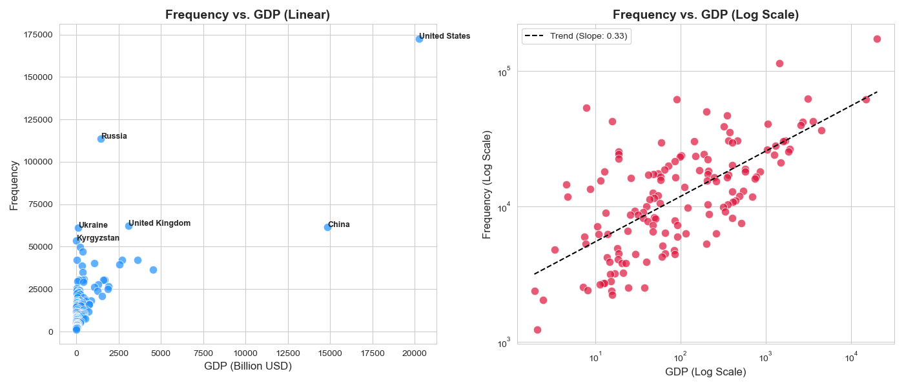
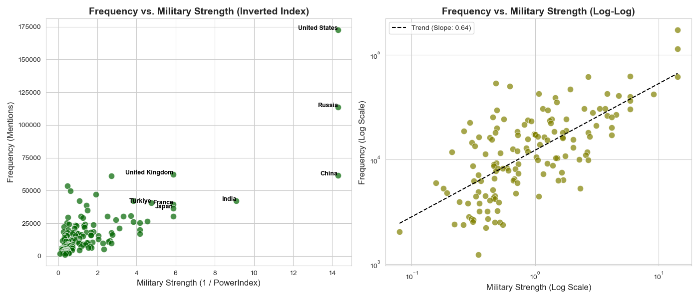
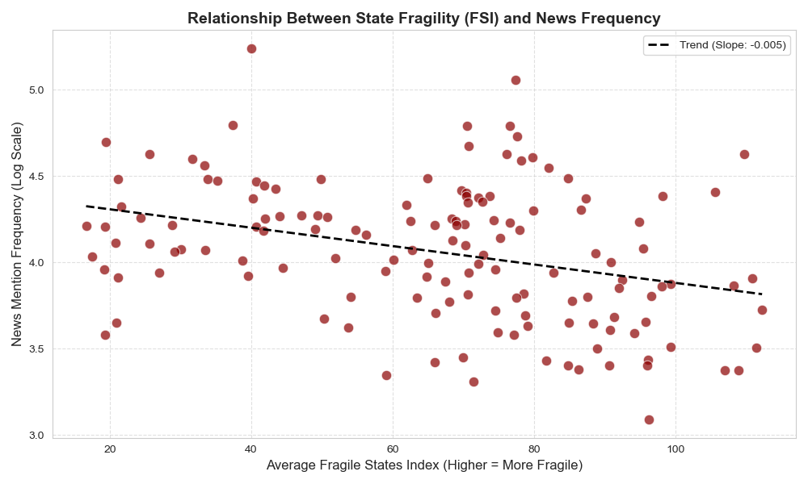
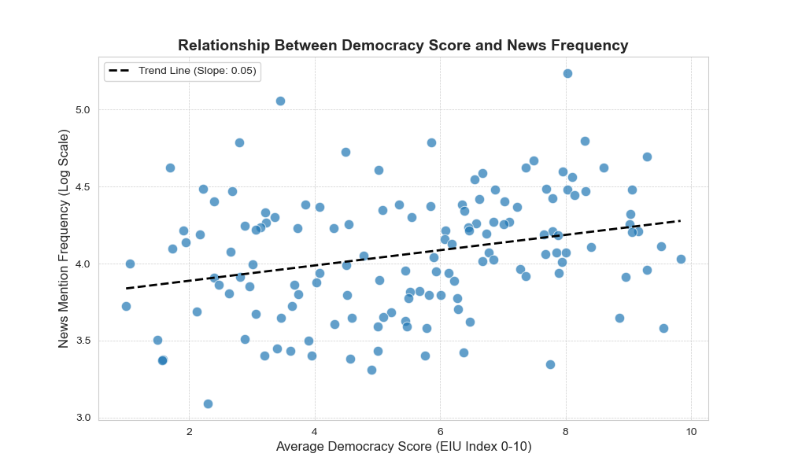
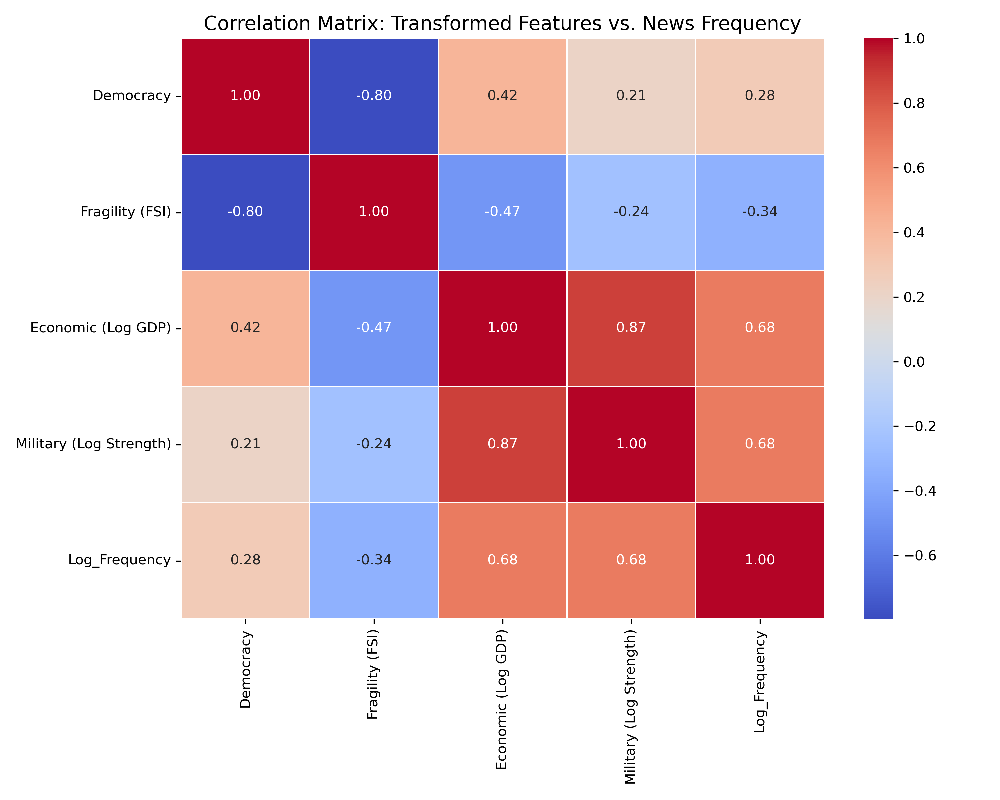
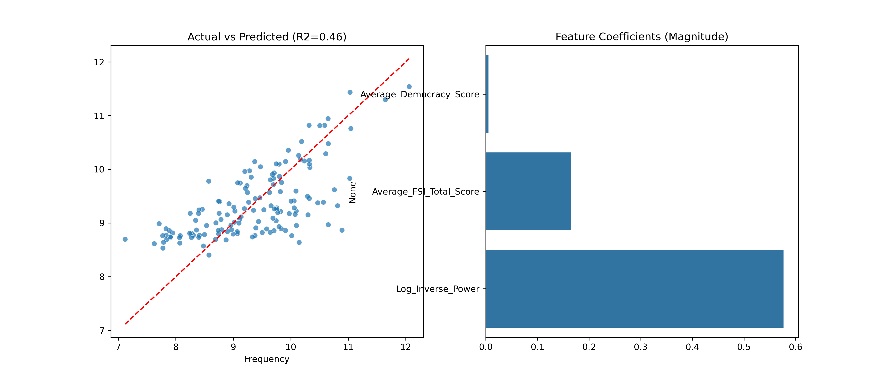
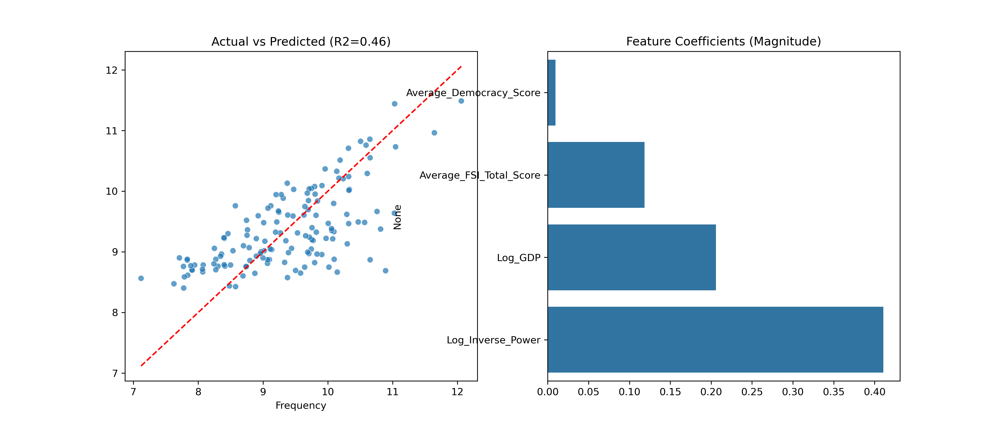
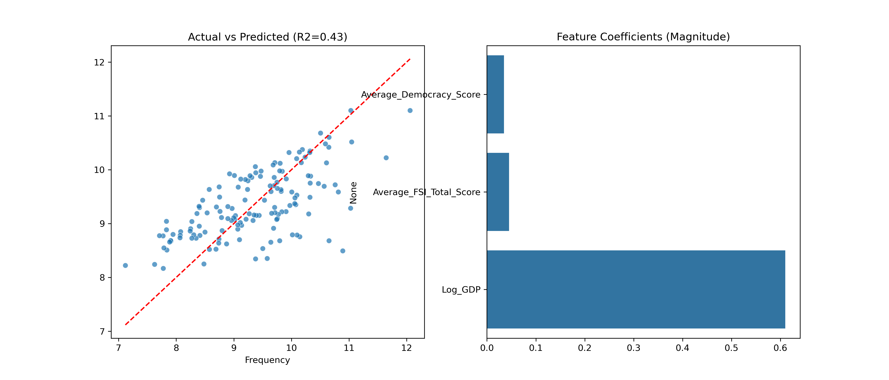
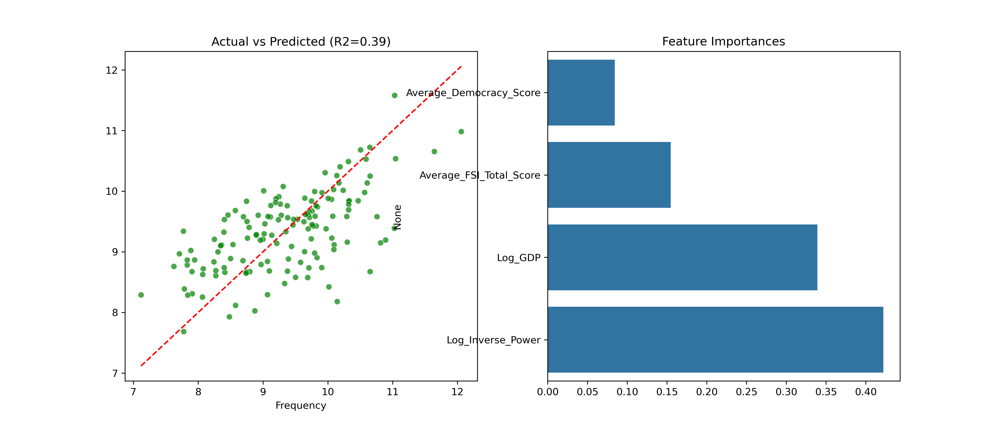
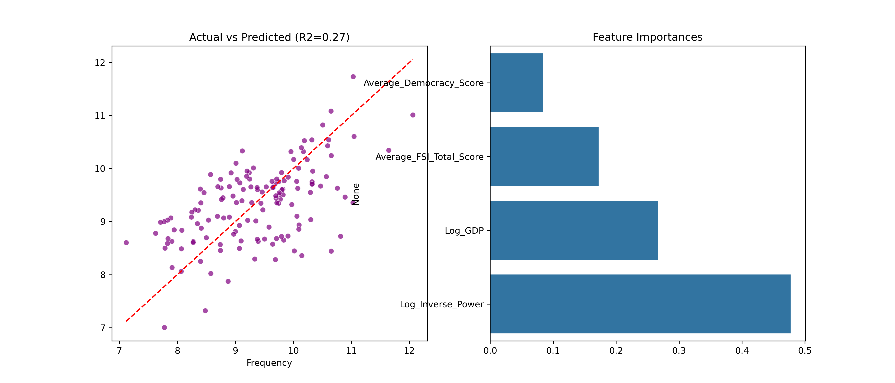

# DSA-210-project
# Table of Contents
* [Introduction](#introduction)
* [Motivation](#motivation)
* [Project Proposal](#project-proposal)
* [Data Sources](#data-sources)
* [Main Hypotheses](#main-hypotheses)
* [Methodology](#methodology)
  * [1. Data Processing](#1-data-processing)
  * [2. Data Cleaning & Imputation](#2-data-cleaning--imputation)
  * [3. Data Processing Pipeline](#3-data-processing-pipeline)
* [Analysis & Results](#analysis--results)
  * [1. Visual Analysis](#1-visual-analysis)
  * [2. Hypothesis Testing](#2-hypothesis-testing)
* [3. Machine Learning Results & Analysis](#3-machine-learning-results--analysis)
  * [A. Feature Correlation](#a-feature-correlation)
  * [B. Model Performance Comparison](#b-model-performance-comparison-loocv)
  * [C. Visualizing the Predictions](#c-visualizing-the-predictions)
  * [Final Verdict: Linear Regression](#final-verdict-linear-regression)
* [4. Final Conclusion](#4-final-conclusion)
* [5. Limitations & Future Work](#5-Limitations--Future-Work)

# Introduction
In this project, I analyze the key factors that drive a country's **frequency of global mentions**. I investigate why some nations dominate the global news cycle and diplomatic reports while others receive little attention, specifically focusing on whether this visibility is driven by "Hard Power" or "Soft Power."

# Motivation
In an interconnected world, **attention is a currency**. The frequency with which a country appears in global news and diplomatic cables significantly influences its ability to attract aid, investment, and political support.

However, this global spotlight is unevenly distributed. A crisis in one nation may dominate headlines for months, while similar events elsewhere go unreported. This raises a critical question for data science: **Is global visibility driven by "Soft Power" ideals (Democracy, Stability) or "Hard Power" realities (Military, GDP)?**

Understanding the mechanics of this attention bias is not just an academic exercise—it reveals the unwritten rules of the modern international system. By quantifying these drivers, this project aims to determine whether the world listens to those who are *virtuous* or simply those who are *powerful*.

# Project Proposal
This project aims to uncover the underlying determinants of **international visibility**. By integrating large-scale text frequency data with major global indicators, I explore which characteristics—**Economic Wealth (GDP)**, **Military Strength**, **Fragile State Index** or **Democratic Status**—best predict how often a country is reported on by the rest of the world.

# Data Sources
The main source of data is the **Diplomatic text dataset** from GlobalDiplomacyNet project (https://dataverse.harvard.edu/dataset.xhtml?persistentId=doi%3A10.7910/DVN/HYJDE0)

Other sources combined with this dataset:
1) **GDP by country dataset** --> from Our World in Data (https://ourworldindata.org/grapher/gdp-worldbank-constant-usd) (average of last available 10 years of a country)
2) **Democracy index by country dataset** --> from kaggle (https://www.kaggle.com/datasets/shreyasur965/democracy-index)
3) **Military Ranking** --> from Global Firepower Index (https://www.globalfirepower.com/countries-listing.php)
   * *Note:* Official website only hosts 2025 data. Historical data (2017-2024) was retrieved from archives to create a robust average:
     * https://www.scribd.com/document/433674720/2019-Military-Strength-Ranking
     * https://www.kaggle.com/datasets/mingookkim/world-military-power-2020
     * https://www.kaggle.com/datasets/sleymanzeynul/military-strengths-of-countries-2021
     * https://www.kaggle.com/datasets/mickaelandrieu/global-fire-power-ranking-2022
     * https://www.kaggle.com/datasets/hanif13/global-firepower-2023
     * https://www.kaggle.com/datasets/chayanonc/military-strength-by-country-2024
4) **Fragile States Index** --> from Fragile States Index (https://fragilestatesindex.org/global-data/) (average of last  10 years )

# Main Hypotheses 
* **H1:** There is a relation between **GDP** of a country and number of mentions of country by other countries.
* **H2:** There is a relation between **Democracy index** of a country and number of mentions of country by other countries.
* **H3:** There is a relation between **Military power** of a country and number of mentions of country by other countries.
* **H4:** There is a relation between **Fragile State Index** of a country and number of mentions of country by other countries. 

# Methodology
## 1. Data Processing
* **News Frequency:** Processed raw `news.jsonl` files, filtering out countries with fewer than **1,000 mentions** to remove noise.
* **Name Normalization:** Manually mapped inconsistent country names (e.g., "Turkey" ↔ "Türkiye", "Ivory Coast" ↔ "Côte d'Ivoire") to ensure accurate merging across datasets.

## 2. Data Cleaning & Imputation
To ensure a comprehensive analysis, we addressed two main challenges in the raw data: **Naming Inconsistencies** and **Missing Values** for key geopolitical entities.

### A. Naming Harmonization
Country names were standardized across all 5 datasets to match the master "News Frequency" list.
* **Examples:** "Turkey" $\rightarrow$ "Türkiye", "Ivory Coast" $\rightarrow$ "Côte d'Ivoire", "Russian Federation" $\rightarrow$ "Russia".

### B. Strategic Imputation
Standard international datasets (like the World Bank or UN) often exclude non-member entities like **Taiwan**, **Hong Kong**, and **Kosovo**. However, these are high-visibility actors in global news.

Instead of dropping them (which would bias the "News Frequency" analysis), we imputed their missing values using reasoned estimates from regional peers and alternative reports:

* **GDP:** Imputed for **Taiwan** using official national statistical data (since it is excluded from World Bank data).
* **Democracy Index:** Imputed for **Hong Kong** and small island nations using the average scores of their respective regions.
* **Fragile States Index (FSI):** Imputed for **Taiwan**, **Hong Kong**, and **Kosovo** by referencing the scores of comparable regional peers (e.g., South Korea, Singapore, and Balkan neighbors).
* **Military Power:** Imputed for entities missing from the GlobalFirePower index by referencing similar-sized military powers in their region.

## 3. Data Processing Pipeline 
To ensure robustness, we did not simply merge raw files. Instead, we created **Intermediate Processed Datasets** by averaging historical data to smooth out yearly anomalies. The data was generated in the following order:

### A. Generating Intermediate "Average" Files
Before the final merge, each indicator was processed individually to create a single representative score for each country:
* **Step 1: GDP Processing (`gdp_avg`)**
    * *Input:* Raw World Bank Data (Yearly columns).
    * *Action:* Filtered for the last decade (2011-2020) and calculated the mean.
    * *Output:* A cleaned list of ~200 countries with their 10-year average economic size.
* **Step 2: Democracy Processing (`democracy_avg`)**
    * *Input:* Raw EIU Democracy Index.
    * *Action:* Averaged scores from 2013-2020 to determine the country's sustained political regime type.
* **Step 3: Military Processing (`military_avg`)**
    * *Input:* 8 separate files (2017, 2019, 2020, 2021, 2022, 2023, 2024, 2025).
    * *Action:* Merged all years and calculated the mean `PowerIndex` to fix outliers (e.g., a country temporarily dropping in rank due to data errors).
* **Step 4: FSI Processing (`fsi_avg`)**
    * *Input:* Fragile State Index raw data.
    * *Action:* Averaged the "Total" score over the last available 10 years.

### B. The Master Merge Sequence
Once the intermediate datasets were ready, we built the final dataset using the **News Frequency** list as the "Backbone" to ensure we only kept countries relevant to our text analysis:
1.  **Base:** Start with `News Frequency` (Entities with >1,000 mentions).
2.  **Merge 1:** Attach `gdp_avg` (Inner Join).
3.  **Merge 2:** Attach `democracy_avg` (Inner Join).
4.  **Merge 3:** Attach `military_avg` (Inner Join).
5.  **Merge 4:** Attach `fsi_avg` (Left Join).
    * *Note:* A Left Join was used here because some high-visibility entities (like Taiwan) are missing from the FSI source but needed to be kept for manual imputation.

### C. Final Output
* **File:** `final_complete_dataset.csv`
* **Content:** A single row per country containing its Frequency, Average GDP, Average Democracy Score, Average Military Power, and FSI Score.

# Analysis & Results
## 1. Visual Analysis
Below are the key visualizations illustrating the relationship between national indicators and global news coverage.

### A. Economic Power (GDP) vs. Attention

> **Figure 1:** The relationship between GDP and News Frequency (Log-Log Scale). There is a clear, strong linear trend ($r \approx 0.61$), indicating that a country's economic size is a primary driver of its global visibility.

### B. Military Strength vs. Attention

> **Figure 2:** Military Power vs. News Frequency. This indicator demonstrated the **strongest correlation** ($r \approx 0.65$) of all variables tested. The "Hard Power" bias is evident, as nations with higher military capabilities dominate the news cycle.

### C. State Fragility (FSI) vs. Attention

> **Figure 3:** Fragile States Index vs. News Frequency. Contrary to the popular "if it bleeds, it leads" assumption, our data shows a **negative correlation** ($r \approx -0.33$). Highly fragile, unstable states often receive *less* coverage than stable, powerful nations, unless they are strategically important.

### D. Democracy vs. Attention

> **Figure 4:** Democracy Index vs. News Frequency. While there is a slight preference for democratic nations, the relationship is weak ($r \approx 0.29$) and highly scattered compared to economic and military indicators.

## 2. Hypothesis Testing
To rigorously determine the drivers of news coverage, we performed two types of statistical tests.

### A. Spearman Rank Correlation
We used Spearman's rank correlation (instead of Pearson) to handle extreme outliers like the USA and China.
* **Military Power:** Strongest correlation ($r \approx 0.65$, $p < 0.001$).
* **GDP:** Strong correlation ($r \approx 0.61$, $p < 0.001$).
* **Democracy:** Weak correlation ($r \approx 0.29$).
* **FSI:** Strong correlation ($r \approx -0.338$, $p < 0.001$).

### B. Two-Sample T-Test
We split countries into "High" (Top 50%) and "Low" (Bottom 50%) groups based on the median of each variable to see if the means differed significantly.
* **Military Power:** The "Strong Military" group receives **2.5x more news mentions** than the weak group ($p < 0.001$).
* **GDP:** The "High GDP" group receives significantly more mentions than the low group ($p < 0.001$).
* **Democracy:** The "High Democracy" group receives more mentions than the low group, but the difference is much smaller compared to Military and GDP.
* **FSI:** No significant difference between the groups

# 3. Machine Learning Results & Analysis

We trained three distinct models to predict a country's **News Frequency** based on its national indicators (GDP, Military Power, Democracy, Fragility).

### A. Feature Correlation
First, we analyzed how our features correlate with the target variable (`Log_Frequency`).

* **Key Finding:** * **Key Finding:** Economic Power and Military Strength show the strongest positive correlation (0.87). To determine which one is the true driver, we split the Linear Regression into three experimental models: One with both, one without Military, and one without GDP.

---

### B. Model Performance Comparison (LOOCV)

We evaluated models using **Leave-One-Out Cross-Validation (LOOCV)** to ensure robust testing on our dataset of ~150 countries.

| Model | RMSE (Error) $\downarrow$ | $R^2$ Score (Accuracy) $\uparrow$ | Interpretation |
| :--- | :--- | :--- | :--- |
| **Linear Regression (exclude GDP)** | **0.6684** (Lowest) | **0.4629** (Highest) | **Winner.**  |
| **Linear Regression(both GDP and military)** | 0.6693 | 0.4615|**Slightly Lower.** Adding GDP introduced noise/redundancy.    |
| **Linear Regression(exclude military)** | 0.6897  | 0.4281|**Considerably worse than other LG models** Economic wealth alone is a weaker predictor.    |
| **Random Forest** | 0.7132 | 0.3884 | **Overfitting.** The model tried to find complex rules that didn't exist, hurting its test performance. |
| **Gradient Boosting** | 0.7802 (Highest) | 0.2683 (Lowest) | **Overfitting.** The model was too complex for the small sample size (~150 countries). |

---

### C. Visualizing the Predictions

Below are the **Actual vs. Predicted** plots for each model. A perfect model would align all blue dots on the red diagonal line.

####  Model A.3: Linear Regression without GDP (The Winner)

* **Observation:** This model aligns best with the diagonal, proving that focusing on Military Power yields the most accurate predictions.

####  Model A.1: Linear Regression with both

* **Observation:** Adding GDP did not improve the fit; the results are nearly identical (or slightly worse) than the Military-only model.

####  Model A.2: Linear Regression without Military 

* **Observation:** Without Military Power, the model struggles more to predict global attention, resulting in higher error.

####  Model B: Random Forest

* **Observation:** While it captures the general trend, the points are more scattered compared to the linear model, indicating higher variance (overfitting).

####  Model C: Gradient Boosting

* **Observation:** This model shows significant scattering, proving it is too complex for this specific sample size.

---
##  Final Verdict: Linear Regression

The **Linear Regression** model is the clear winner for this project.

**Why did the simplest model win?**
1.  **The "Power Law" Reality:** Global news attention follows a power law (a few countries get *massive* attention, most get little). After we applied log-transformations, this relationship became linear.
2.  **Sample Size:** With only ~150 data points (countries), complex models like Gradient Boosting tend to "memorize" noise rather than learning general rules.
3.  **Conclusion:** A country's visibility in the global news cycle is primarily determined by a straightforward, linear combination of its **Hard Power** (GDP and Military Strength).

# 4. Final Conclusion

By combining statistical hypothesis testing with machine learning ablation studies, we have reached a robust conclusion about what drives global visibility.

### A. Military Power is the "Master Variable"
Our ablation study yielded a decisive result: **The "Military Focus" model outperformed both the "GDP Focus" model and the "Combined" model.**
* This confirms that the global diplomatic network is driven primarily by **Security Realism**. The world pays attention to nations that can project force.
* While economic power is important, it generates significantly less "news frequency" than military capacity.

### B. The "Shadow" of Wealth (Why GDP was Redundant)
Crucially, adding GDP to the Military model did not improve performance—it actually slightly hurt it.
* **Interpretation:** This suggests that GDP is merely a *prerequisite* for Military Power. Wealthy nations build strong militaries, but it is the **Military Capability itself** that drives the attention.
* **The Lesson:** A rich nation with no military presence (e.g., small wealthy states) receives far less attention than a militarized power.

### C. Stability Over Fragility
Contrary to the belief that "bad news travels fast," our data suggests that **Stability** attracts more consistent global attention than Fragility.
* The **Fragile State Index (FSI)** had a negative correlation with news frequency.
* Global diplomacy and news cycles prioritize powerful, stable actors over fragile states, likely due to their central role in the global economy and security architecture.

###  Summary
If a country wants to increase its global "share of voice," **Military Power** is the single most decisive factor. Wealth helps build an army, but **Hard Power** is what captures the world's attention.

# 5. Limitations & Future Work

While this project successfully identified "Hard Power" as the primary driver of global attention, several limitations remain that future research could address.

### A. Limitations
1.  **Causality vs. Correlation:** Our analysis establishes a strong predictive relationship, but it cannot prove strict causality. While it is logical that military power drives attention, unobserved variables (e.g., historical colonial ties, trade routes) could influence both.
2.  **Static Timeframe:** We averaged data over a 10-year period (2011-2020) to create a robust cross-sectional study. This obscures temporal dynamics—for example, a small country might briefly dominate global news during a specific crisis (e.g., a natural disaster or coup) despite having low average power.
3.  **Language Bias:** The "GlobalDiplomacyNet" dataset is primarily derived from English-language sources and Western diplomatic cables. This inherently biases the "News Frequency" metric toward the geopolitical interests of the Anglosphere.
4.  **Sample Size Constraints:** With only ~150 sovereign nations as data points, the dataset is too small for complex Machine Learning models. This explains why Random Forest and Gradient Boosting overfitted, while simple Linear Regression generalized best.

### B. Future Directions
1.  **Temporal Analysis:** Instead of 10-year averages, future work could model this as a **Time-Series Forecasting** problem. Does an increase in a country's military budget in Year $T$ predict a rise in news coverage in Year $T+1$?
2.  **Sentiment Analysis:** This project focused on the *quantity* of attention (Frequency). A natural next step is to analyze the *quality* (Sentiment). Do "Hard Power" nations receive more negative coverage (fear/threats), while "Soft Power" nations receive positive coverage?
3.  **Network Analysis:** Rather than just counting global mentions, we could construct a **Directed Graph** ($Country A \to mentions \to Country B$) to see if the "Attention Hierarchy" is centralized around specific superpowers or regional hubs.
4.  **Cultural Indicators:** We tested Political "Soft Power" (Democracy). Future iterations could test Cultural "Soft Power" using metrics like **Tourism statistics**, **International Student counts**, or **Cultural Exports** (movies, music) to see if they offer a competing signal to Military Power.
